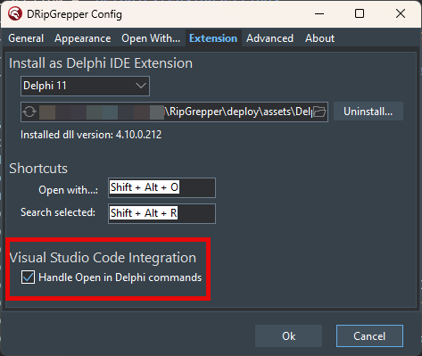

# Open in Delphi
A Visual Studio Code extension that lets you open the file you're currently editing directly in the Delphi IDE.  
Requires **[DRipExtensions](https://github.com/mattia72/DRipGrepper)** to be installed and configured in Delphi.

## Features

- Opens the current file in VS Code directly in the Delphi IDE
- Seamless switch between VS Code and Delphi 
- Easy to use via Command Palette, context menu, or keyboard shortcut

## Usage

### Switch from VS Code to Delphi 

Execute the "Open Current File in Delphi" command via:
   - Command Palette (Ctrl+Shift+P) -> "Open Current File in Delphi"
   - Default keyboard shortcut: **Shift+Alt+D**
   - Right-click context menu in the editor or file explorer

### Switch From Delphi to VS Code
 
   - Tools | DRipExtensions | Open With...
     - Default keyboard shortcut: **Shift+Alt+O**
   - Select "Open in VSCode instance" and push enter.
    
## Requirements

- VS Code 1.102.0 or higher
- Delphi IDE installed and configured
- **[DRipExtensions](https://github.com/mattia72/DRipGrepper)** 4.10.0 or higher must be installed and configured in Delphi

## Installation

1. Open Visual Studio Code
2. Go to the Extensions view (Ctrl+Shift+X)
3. Search for "Open in Delphi" 
4. Click "Install" on the extension by Mattia72-OpenInDelphi
5. Alternatively, visit the [marketplace page](https://marketplace.visualstudio.com/items?itemName=Mattia72-OpenInDelphi.openindelphi) and click "Install"

### Prerequisites Setup

**Important**: This extension requires DRipExtensions to be installed in Delphi to work properly.

1. **Install DRipExtensions in Delphi:**
   - Download DRipExtensions from [GitHub releases](https://github.com/mattia72/DRipGrepper/releases)
   - Install it in your Delphi IDE (version 4.10.0 or higher required)

2. **Configure DRipExtensions:**
   - Open Delphi IDE
   - Go to Tools → DRipExtensions → :gear: Settings
   - If necessary, configure the "Open With" settings as shown in the screenshot
   
   

     - If for some reason it is not in the list, configure a new entry with the following parameters:
       - **Caption**: Open in VSCode instance
       - **Command**: `<path-to-vscode>/code.exe`
       - **Parameters**: `--reuse-window --goto "<FILE>:<LINE>:<COL>"`
         
   - Make sure the "Handle Open in Delphi commands" checkbox is checked
   

3. **Verify Installation:**
   - Open a Pascal file in VS Code
   - Press Shift+Alt+D or use Command Palette → "Open Current File in Delphi"
   - The file should open in Delphi IDE at the same line/column

## Extension Settings

This extension provides the following settings:

- `openindelphi.showContextMenu`: Enable/disable the context menu item (default: `true`)
- `openindelphi.showContextMenuOnFileExtension`: Show context menu only for files with specified extensions (default: `["*"]`)
  - Use `["*"]` to show for all file types
  - Use specific extensions like `["pas", "dpr", "dpk"]` to show only for Delphi files
  - Use empty string `[""]` to show only for files without extension (e.g., Makefile, README)
  - Use combination like `["pas", "dpr", ""]` to show for Delphi files and files without extension
  - Use empty array `[]` to disable context menu completely

## Known Issues

No known issues at this time. Please report any bugs or feature requests on the GitHub repository.

## Release Notes

## [1.1.1] - 2025-08-07

### Fixed
- Package size reduced due to removal of unnecessary files

### Previous Releases
- [1.1.0] - Added context menu support for opening files in Delphi IDE
  - Added configurable context menu behavior through extension settings
  - File extension filtering for context menu visibility
- [1.0.29] - Fixed release script call in package.json
- [1.0.28] - Improved Delphi window activation logic for minimized state handling
- [1.0.27] - Updated README.md and improved release automation
- [1.0.13] - Added default keyboard shortcut (Shift+Alt+D) and user notification for pipe failures
- [1.0.0] - Initial release with basic functionality to open files in Delphi IDE

For complete changelog, see [CHANGELOG.md](CHANGELOG.md)
