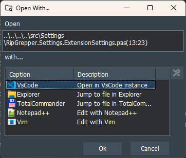
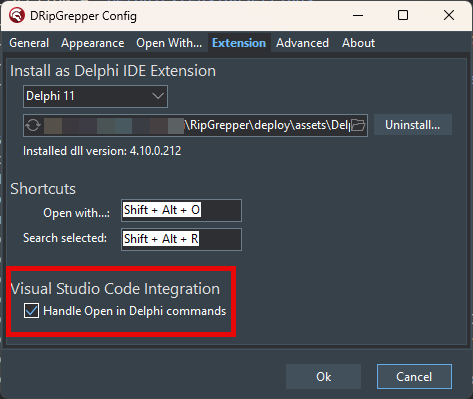

# Open in Delphi
A Visual Studio Code extension that lets you open the file you're currently editing directly in the Delphi IDE.  
Requires **[DRipExtensions](https://github.com/mattia72/DRipGrepper)** to be installed and configured in Delphi.

## Features

- Opens the current file in VS Code directly in the Delphi IDE
- Seamless switch between VS Code and Delphi 
- Easy to use via Command Palette, context menu, or keyboard shortcut

## Usage

### Switch from VS Code to Delphi 

Execute the "Open Current File in Delphi" command via:
   - Command Palette (Ctrl+Shift+P) -> "Open Current File in Delphi"
   - Default keyboard shortcut: **Shift+Alt+D**

### Switch From Delphi to VS Code
 
   - Tools | DRipExtensions | Open With...
     - Default keyboard shortcut: **Shift+Alt+O**
   - Select "Open in VSCode instance" and push enter. 
       - If for some reason it is not in the list, configure a new entry with the following parameters:
         - **Caption**: Open in VSCode instance
         - **Command**: `<path-to-vscode>/code.exe`
         - **Parameters**: `--reuse-window --goto "<FILE>:<LINE>:<COL>"`

## Requirements

- VS Code 1.102.0 or higher
- Delphi IDE installed and configured
- **[DRipExtensions](https://github.com/mattia72/DRipGrepper)** 4.10.0 or higher must be installed and configured in Delphi

## Extension Settings

This extension does not contribute any custom settings.

## Known Issues

No known issues at this time. Please report any bugs or feature requests on the GitHub repository.

## Release Notes

- Default keyboard shortcut (Shift+Alt+D) for 'Open Current File in Delphi' command
- User notification if sending to Delphi via the pipe fails, with suggestion to check Delphi and DripExtensions settings
